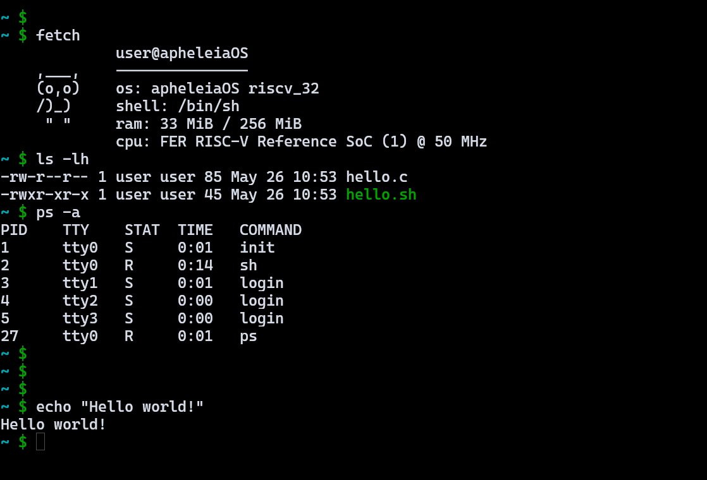

# Apheleia operating system (AOS)

`In Greek mythology, Apheleia (Ἀφέλεια) was the spirit and personification of ease, simplicity and primitivity in the good sense ...` - [Wikipedia](https://en.wikipedia.org/wiki/Apheleia)

### What is AOS?

Apheleia is a small UNIX-like hobby operating system made for fun and as a learning opportunity.
It aims to be as minimalistic and simple as possible while still providing basic functionality.

The current tree supports `x86_64`, `x86_32`, `riscv_64`, and `riscv_32` builds, x86 BIOS boot, RISC-V emulator and [FRISC](https://github.com/friscv) FPGA images, and a small windowed userland.




### What does this repository include?

- the kernel source in `kernel/`
- the userspace tree in `userland/{core,ui,tools,games}`
- the staged root filesystem content in `root/`
- the libc and support libraries in `libs/`
- build, image, Docker, and emulator helpers in `utils/`
- some other small miscellaneous libs with common functions/macros

### How to build and run?

Docker is the recommended first build path because it brings its own toolchain:

```bash
make docker_build
```

That builds the Docker image if needed and then builds AOS inside it. Use `make docker_image` only when you want to rebuild the container image without building the OS.

For a local Linux build, install the matching compiler, binutils, emulator, and image tools for the target architecture:

```bash
make all
make run
```

Build options are passed as normal make variables:

```bash
make all ARCH=x86_32
make ARCH=riscv_32 TOOLCHAIN=llvm run-spike
make all ARCH=riscv_32 TOOLCHAIN=llvm RISCV_FRISC=true
make all ARCH=riscv_32 TOOLCHAIN=llvm USERLAND=tcc
make all ARCH=riscv_32 TOOLCHAIN=llvm USERLAND=mbrot,tcc
```

Common build variables:

| Variable | Default | Values | Notes |
| --- | --- | --- | --- |
| `ARCH` | `x86_64` | `x86_64`, `x86_32`, `riscv_64`, `riscv_32` | target architecture |
| `TOOLCHAIN` | `gnu` | `gnu`, `llvm` | compiler/toolchain family |
| `IMAGE_FORMAT` | `img` | `img`, `iso` | `iso` is for x86 images |
| `PROFILE` | `fast` | `fast`, `normal`, `small`, `debug`, `debug_extra` | optimization and debug level |
| `RISCV_FRISC` | `false` | `true`, `false` | build a [FRISC](https://github.com/friscv) FPGA image |
| `USERLAND` | `default` | `default`, `all`, `core`, or names such as `mbrot,tcc` | select userland programs; names are added to `default`, while `core` keeps only core programs |
| `DOCKER_IMAGE` | `apheleia:latest` | image tag | Docker image name |

Successful builds write images to:

```bash
bin/apheleia_<version>_<arch>.<format>
```

CI builds and uploads all supported images on every push, pull request, and manual run. Download them from the [images workflow artifacts](https://github.com/cappig/apheleiaOS/actions/workflows/images.yml):

- `apheleia-x86_64-img`
- `apheleia-x86_32-img`
- `apheleia-x86_64-iso`
- `apheleia-x86_32-iso`
- `apheleia-riscv_64-img`
- `apheleia-riscv_32-img`
- `apheleia-riscv_32-frisc-img`

### License

This entire repo is released under the terms of the GPLv3 (see `license`). Feel free to reuse, build upon or reference this code as long as your projects respect the GPL i.e. are free software themselves.

`~ Happy hacking :^)`
