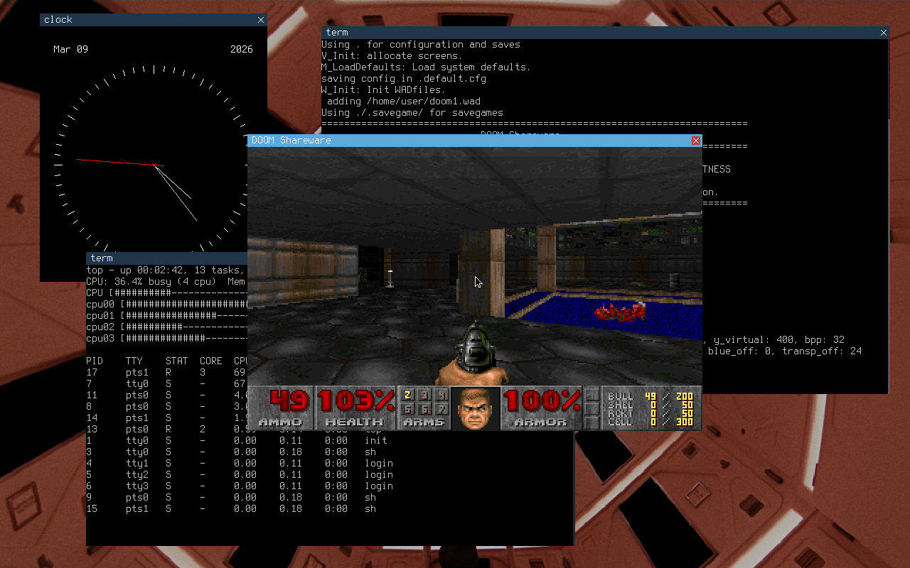

# Apheleia operating system (AOS)

`In Greek mythology, Apheleia (Ἀφέλεια) was the spirit and personification of ease, simplicity and primitivity in the good sense ...` - [Wikipedia](https://en.wikipedia.org/wiki/Apheleia)

### What is AOS?

Apheleia is an x86 UNIX-like hobby operating system made for fun and as a learning opportunity.
It aims to be as minimalistic and simple as possible while still providing basic functionality.

The current tree supports `x86_64` and `x86_32` builds, BIOS boot by default, optional x86_64 UEFI boot, SMP bring-up, and a small windowed userland.



### What does this repository include?

- the kernel source in `kernel/`
- the userspace tree in `userland/{core,ui,tools,games}`
- the staged root filesystem content in `root/`
- the libc and support libraries in `libs/`
- image/QEMU/OVMF helpers in `utils/`
- some other small miscellaneous libs with common functions/macros

### How to build and run?

Build under docker (*recommended*):

```bash
make docker_image docker_build
```

Build locally on a Linux machine with the GNU toolchain:

```bash
make
```

After a successful default build, a disk image will be generated at:

```bash
bin/apheleia_alpha-0.4_x86_64.img
```

You can run it using QEMU with:

```bash
make run
```

Useful variants:

```bash
# 32-bit build
make ARCH=x86_32

# Run with 4 virtual CPUs
make run QEMU_SMP=4

# Use KVM when available
make run KVM=true

# Build an ISO instead of the default raw disk image
make IMAGE_FORMAT=iso

# x86_64 UEFI boot
make run BOOT=uefi
```

### License

This entire repo is released under the terms on the GPLv3 (see `license`). Feel free to reuse, build upon or reference this code as long as your projects respect the GPL i.e. are free software themselves.

`~ Happy hacking :^)`
